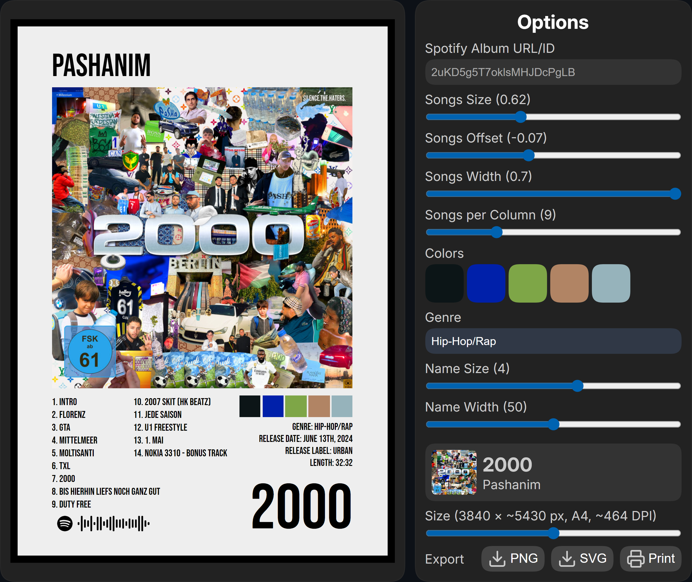

# 🖼️🎵 Album Poster Generator

Turn your favorite Spotify albums into customizable posters, perfect for printing, sharing, or decorating your room!

**Live Demo:** https://album-poster-generator.netlify.app

  

## ✨ Features

- Enter any **Spotify album URL/ID** to fetch real album data (cover, tracklist, info, etc.)
- Generate **beautiful** posters with your album's songs, artists and vibe :)
- Highly customizable:
  - Songs: size, offset, width, columns
  - Color palette
  - Genre, release date, label, length
  - Name (album title) size & width
- Export as **PNG**, **SVG**, or print directly with high-resolution: up to 6720 × ~9503 px (A4: ~813 DPI)
- Responsive design — works great on desktop and mobile

### Upcoming
- [ ] Custom albums (artists, cover, tracklist, code, info, title, etc.)
- [ ] Option to get a poster for an artist, song, etc.

> [!NOTE]
> For suggestions **text me on Discord** or **email me**.

## 📸 Example

<table>
  <tr>
    <td>Option</td>
    <td>Value</td>
    <td>Exported Poster</td>
  </tr>
  <tr>
    <td>Spotify Album URL/ID</td>
    <td>2uKD5g5T7oklsMHJDcPgLB</td>
    <td rowspan="9"></td>
  </tr>
  <tr><td>Songs Size</td><td>0.62</td></tr>
  <tr><td>Songs Offset</td><td>-0.07</td></tr>
  <tr><td>Songs Width</td><td>0.7</td></tr>
  <tr><td>Songs per Column</td><td>9</td></tr>
  <tr><td>Colors</td><td>#0c1517, #0020aa, #7ea647, #b18464, #96b3bb</td></tr>
  <tr><td>Genre</td><td>Hip-Hop/Rap</td></tr>
  <tr><td>Name Size</td><td>4</td></tr>
  <tr><td>Name Width</td><td>100</td></tr>
</table>

<small>Pashanim - 2000</small>

## 🚀 Build-in Spotify Album API

Want just the clean album JSON?

- Visit: `https://album-poster-generator.netlify.app/album/ALBUM_ID`
- Example: https://album-poster-generator.netlify.app/album/2uKD5g5T7oklsMHJDcPgLB

Returns full Spotify album data (`available_markets` removed for cleaner output) via Netlify Functions.

## 🛠️ Tech Stack

- **Frontend**
  - [Vue](https://vuejs.org)
  - [Vite](https://vite.dev)
  - [SnapDOM](https://snapdom.dev) (Poster Rendering)
  - [Lucide Vue Next](https://lucide.dev/guide/packages/lucide-vue-next) (Icons)
- **Backend**
  - [Spotify Web API](https://developer.spotify.com/web-api) (Album Endpoint)
  - [Netlify Functions](https://www.netlify.com/platform/core/functions)
  - [Express](https://expressjs.com)
  - [serverless-http](https://www.npmjs.com/package/serverless-http)
- **Deployment**: [Netlify](https://www.netlify.com)